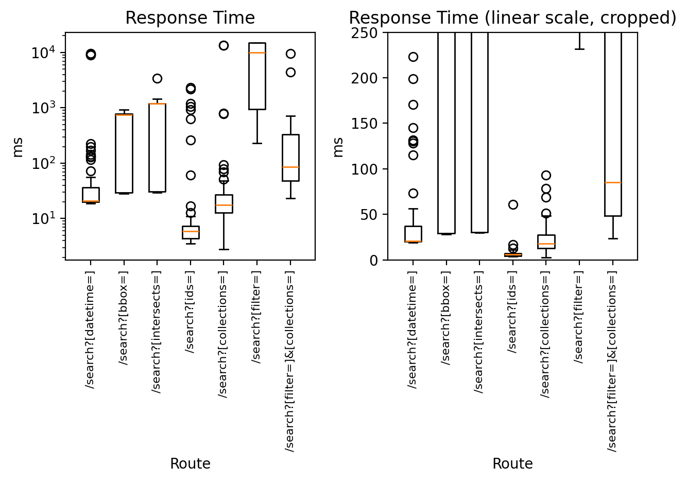

# stac-fastapi-static

<p align="center">
  
  
</p>

[Static STAC Catalog](https://github.com/radiantearth/stac-spec/tree/master/catalog-spec) backend for [stac-fastapi](https://github.com/stac-utils/stac-fastapi), the [FastAPI](https://fastapi.tiangolo.com/) implementation of the [STAC API spec](https://github.com/radiantearth/stac-api-spec).

## Overview

**stac-fastapi-static** is a [stac-fastapi](https://github.com/stac-utils/stac-fastapi) backend built in [FastAPI](https://fastapi.tiangolo.com/). It provides an implementation of the [STAC API spec](https://github.com/radiantearth/stac-api-spec) ready to be deployed on top of a static STAC catalog. The target backend static catalog can be remotely hosted (by any static HTTP server) or locally hosted (filesystem).

## STAC API Support

| Extension                                                                                        | Support |
| ------------------------------------------------------------------------------------------------ | ------- |
| [**Core**](https://github.com/radiantearth/stac-api-spec/tree/release/v1.0.0/core)               | **Yes** |
| [**Item Search**](https://github.com/radiantearth/stac-api-spec/tree/release/v1.0.0/item-search) | **Yes** |

### STAC API Extensions Support

From [STAC API Extensions](https://stac-api-extensions.github.io/) page :

| Extension                                                                                                                                                             | Support                                                                                                                                                                                 |
| --------------------------------------------------------------------------------------------------------------------------------------------------------------------- | --------------------------------------------------------------------------------------------------------------------------------------------------------------------------------------- |
| [**Collection Search**](https://github.com/stac-api-extensions/collection-search)                                                                                     | **Yes**                                                                                                                                                                                 |
| [**Filter**](https://github.com/stac-api-extensions/filter)                                                                                                           | **Yes**                                                                                                                                                                                 |
| [**Query**](https://github.com/stac-api-extensions/query)                                                                                                             | **No** - Not intended : _"It is recommended to implement the Filter Extension instead of the Query Extension" [Query Extension homepage](https://github.com/stac-api-extensions/query)_ |
| [**Sort**](https://github.com/stac-api-extensions/sort)                                                                                                               | **No** - Not intended : Hard to implement in an performant enough manner to be viable with a static catalog                                                                             |
| [**Transaction**](https://github.com/stac-api-extensions/transaction) and [**Collection Transaction**](https://github.com/stac-api-extensions/collection-transaction) | **No** - Not intended - Feasible                                                                                                                                                        |
| [**Fields**](https://github.com/stac-api-extensions/fields)                                                                                                           | **No** - Not intended - Feasible                                                                                                                                                        |
| [**Language**](https://github.com/stac-api-extensions/language)                                                                                                       | **No** - Maybe soon ? - Feasible                                                                                                                                                        |

## Use Case

First there are the general STAC use cases : see [the STAC spec website](https://stacspec.org/en).

Then there are the advantages of using a static catalog :

- Easier initial exploration, and easier exploration in general for non-technical people by using [stac-browser](https://radiantearth.github.io/stac-browser/#/?.language=en) _(which can be made beautiful, see [this catalog](https://browser.apex.esa.int/?.language=en) for instance)._
- No database to maintain.

And finally there is what `stac-fastapi-static` brings in addition to the above :

- **plug-and-play** - Just `pip install` or `docker run` the server while pointing it to your deployed or local static catalog.json (see below).
- **very easy to migrate to (and from)** - `stac-fastapi-static` only requires a valid STAC catalog which it won't touch (just read).
- best possible performances **given the inherent limits of filesystem reads** - We tried to take advantage of every details of the STAC spec to speed up requests (see below).

### Performances and limitations

Inherently, building an API on a 100,000s items static STAC catalog is going to be far slower than on a database backed catalog, however the STAC specs defines constraints (and recommendations) that can be abused to design a performant enough API.

Our goal is to provide viable performances on a 500,000 item static catalog.



_Response times obtained on a (yet) unpublished catalog at the OPGC._

Results depend quite heavily on the catalog structure. `stac-fastapi-static` is more efficient the more tree-like the catalog is (e.g. serving a single collection of 10,000s items is going to be very inefficient, while on the other hand a deeply nested catalog will be quite efficiently served). Feel free to test on your own catalog :

```bash
just benchmark <path-to-catalog.json>
```

## Usage

### Prefered Method : Containerized API Server

```bash
docker run \
  --env-file .env \
  --env app_port=8000 \
  --env app_host=0.0.0.0 \
  --env environment=production \
  --env log_level=warning \
  --env catalog_href=/var/www/html/static/catalog.json \
  --volume /tmp:/tmp \
  --volume /var/www/html/static:/var/www/html/static \
  --publish 8080:8000 \
  ghcr.io/fntb/stac-fastapi-static:latest
```

### Alternative Method : Python Packaged API Server

Install, create a `dotenv` configuration file (or pass configuration options as env variables), and run :

```bash
pip install stac-fastapi-static

# either
touch .env
stac-fastapi-static

# or
<option>=<value> stac-fastapi-static
```

### Configuration Options

See [the Settings model](./stac_fastapi/static/api/config.py).

Amongst other :

```python
class Settings(ApiSettings):
    # https://docs.pydantic.dev/latest/concepts/pydantic_settings/

    ...

    app_host: str = "127.0.0.1"
    app_port: int = 8000
    root_path: str = ""

    ...
```

### Test and Develop

```bash
just --list
```

Or see [the Justfile](./justfile).

Release checklist : bump [version](./stac_fastapi/static/__about__.py), build, test build, commit, tag, push, publish to pypi and ghcr.

## History

**stac-fastapi-static** is being actively developped at the [OPGC](https://opgc.uca.fr/) an observatory for the sciences of the universe (OSU) belonging to the [CNRS](https://www.cnrs.fr/en) and the [UCA](https://www.uca.fr/) by its main author Pierre Fontbonne [@fntb](https://github.com/fntb). It was originally reverse engineered from the [stac-fastapi-pgstac](https://github.com/stac-utils/stac-fastapi-pgstac) backend by [developmentseed](https://github.com/developmentseed).

## License

[OPEN LICENCE 2.0](./LICENCE.txt)
